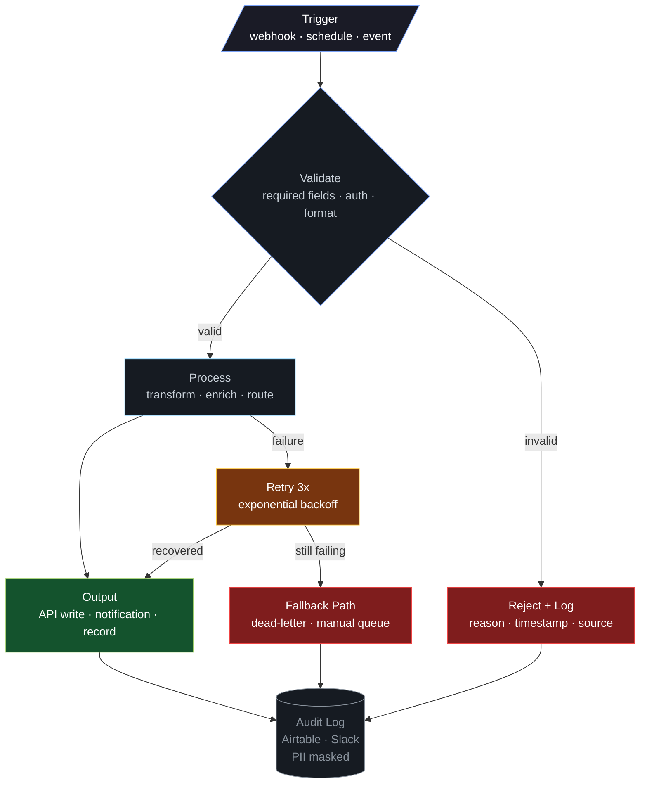

<a href="https://github.com/lorenzespinosa">
  
</a>

<p align="center">
  
  
  
</p>

<p align="center">
  <a href="https://www.linkedin.com/in/lorenz-leslie-espinosa/"></a>
  <a href="mailto:renzespinosa13@gmail.com"></a>
  
</p>

<br>

<p align="center">
  
</p>

<br>

```yaml
apiVersion: automation/v1
kind: Engineer
metadata:
  name: Lorenz Leslie Espinosa
  role: Automation Architect & IT Specialist
spec:
  orgs:
    - name: Leppard Law
      focus: Legal ops — intake, case management, billing, client comms
    - name: Le Cordon Bleu International
      focus: IT infrastructure & marketing automation across multi-tenant Microsoft Cloud
  architecture:
    pattern: webhook-driven, API-first
    buffer_layer: Airtable (staging between systems)
    error_handling: retry 3x with backoff → fallback path → audit log → alert
    principle: never fail silently
  ai_agents:
    production: LLOpenClaw v5.0 — multi-agent Slack bot for legal ops
    framework: OpenClaw (orchestrator + specialist agents with human-in-the-loop)
    models: Claude Sonnet 4 (primary) + free models (heartbeat, compaction)
    tools: 21 MCP tools via n8n — zero tokens on deterministic tasks
  exploring: [LangGraph, RAG pipelines, Temporal workflows, self-healing systems]
```


<table>
<tr>
<td>

**`> status`** &nbsp; LLOpenClaw v5.0 live &nbsp;·&nbsp; 21 MCP tools &nbsp;·&nbsp; 3 specialist agents &nbsp;·&nbsp; orchestrator + human-in-the-loop &nbsp;·&nbsp; saving ~$65/mo in token costs

</td>
</tr>
</table>


## Flagship Systems

> Not workflows — **production systems** with error handling, observability, and measurable business outcomes.

<table>
<tr>
<td width="50%" valign="top">

<h3>🟢 LLOpenClaw</h3>

**Multi-agent AI Slack bot for law firm ops**

Orchestrator delegates to specialist agents (exec, research, ops) with human-in-the-loop gates, n8n MCP integration (21 tools), identity stack, and tiered model routing.

<sub>OpenClaw · Slack · n8n MCP · Claude · Lawmatics · Clio</sub>


</td>
<td width="50%" valign="top">

<h3>🟢 Legal Intake Pipeline</h3>

**Event-driven lead capture → CRM routing**

Webhook capture → validation → AI classification → CRM routing → case creation. Replaced manual data entry across 3 systems.

<sub>n8n · OpenPhone · Lawmatics · Filevine · Airtable</sub>


</td>
</tr>
<tr>
<td width="50%" valign="top">

<h3>🟢 AI Lead Conversion Engine</h3>

**Multi-agent scoring and qualification**

AI scores leads, qualifies, drafts personalized responses, routes to sales — full pipeline from capture to conversion.

<sub>n8n · OpenAI · Celonis · CRM</sub>

 

</td>
<td width="50%" valign="top">

<h3>🟢 Billing Sync Engine</h3>

**Bidirectional case management ↔ billing**

Sync between case management and billing with conflict resolution. CRM is source of truth.

<sub>n8n · Clio · Filevine · Airtable</sub>


</td>
</tr>
</table>

<details>
<summary><b>More systems I've built</b></summary>
<br>

| System | What It Does | Impact |
|--------|-------------|--------|
| **Multi-Agent Task Delegator** | Central AI controller routes natural-language commands to specialized workflows | Routine task time **-30%** |
| **Smart Contract Monitor** | Real-time on-chain Ethereum event detection with anomaly alerting | Diagnosis time **-60%** |
| **AWS Health Sentinel** | Serverless monitoring of AWS Health events → Slack/email alerts | Incident response **-40%** |
| **Discord-Jira Issue Bridge** | Community issues auto-flow into project tracking | **100+ issues/month**, zero manual entry |
| **Community Security System** | Automated phishing, scam bot, impersonation detection | Member retention **+25%** |
| **Martech Data Pipeline** | Unified 1.5TB event data across 6 clients for campaigns | Email CTR **+30%**, churn **-18%** |
| **LLM Compliance Monitor** | AI-RMF aligned pipeline monitoring 100+ agents for bias/drift | **100% regulatory approval** (EU + US) |

</details>


## Open Source

<table>
<tr>
<td width="50%" valign="top">

### <a href="https://github.com/lorenzespinosa/n8n-lint">n8n-lint</a>

<a href="https://github.com/lorenzespinosa/n8n-lint"></a> <a href="https://github.com/lorenzespinosa/n8n-lint"></a> 

**Static analysis for n8n workflow JSON.** Catches credential leaks, deprecated nodes, orphaned connections, and best-practice violations.

```bash
npx n8n-lint .                 # lint all workflows
npx n8n-lint --fix workflows/  # auto-fix safe issues
npx n8n-lint --format json .   # JSON output for CI
```

<sub>16 rules · configurable · auto-fix · CI-ready</sub>

</td>
<td width="50%" valign="top">

### <a href="https://github.com/lorenzespinosa/openclaw-n8n-stack">openclaw-n8n-stack</a>

<a href="https://github.com/lorenzespinosa/openclaw-n8n-stack"></a> <a href="https://github.com/lorenzespinosa/openclaw-n8n-stack"></a> 

**Docker stack: AI agent gateway + workflow automation.** OpenClaw + n8n + PostgreSQL in one `docker compose up`. Pre-wired MCP, multi-agent config.

```bash
git clone ...openclaw-n8n-stack.git
cp .env.example .env && docker compose up -d
```

<sub>saves ~$65/mo · MCP · multi-agent · Docker</sub>

</td>
</tr>
</table>

<table>
<tr>
<td width="33%" valign="top">

<h4><a href="https://github.com/lorenzespinosa/n8n-error-handling-pattern">n8n-error-handling-pattern</a></h4>

Retry with backoff, dead-letter queue, fallback paths, PII-masked audit logging.

<sub><a href="https://github.com/lorenzespinosa/n8n-error-handling-pattern"></a></sub>

</td>
<td width="33%" valign="top">

<h4><a href="https://github.com/lorenzespinosa/n8n-legal-ops-templates">n8n-legal-ops-templates</a></h4>

Client intake, missed call recovery, billing sync, AI case routing.

<sub><a href="https://github.com/lorenzespinosa/n8n-legal-ops-templates"></a></sub>

</td>
<td width="33%" valign="top">

<h4><a href="https://github.com/lorenzespinosa/n8n-ai-agent-delegator">n8n-ai-agent-delegator</a></h4>

Multi-agent orchestrator with confidence scoring and human-in-the-loop.

<sub><a href="https://github.com/lorenzespinosa/n8n-ai-agent-delegator"></a></sub>

</td>
</tr>
<tr>
<td width="33%" valign="top">

<h4><a href="https://github.com/lorenzespinosa/openclaw-setup-guide">openclaw-setup-guide</a></h4>

Production deployment guide — identity stack, security, n8n MCP.

<sub><a href="https://github.com/lorenzespinosa/openclaw-setup-guide"></a></sub>

</td>
<td width="33%" valign="top">

<h4><a href="https://github.com/lorenzespinosa/airtable-automation-toolkit">airtable-automation-toolkit</a></h4>

Python toolkit — DLQ, audit logging, PII masking, staging sync.

<sub><a href="https://github.com/lorenzespinosa/airtable-automation-toolkit"></a></sub>

</td>
<td width="33%" valign="top">

<h4><a href="https://github.com/lorenzespinosa/openphone-n8n-connector">openphone-n8n-connector</a></h4>

OpenPhone + n8n — missed calls, SMS, call logging. TCPA compliant.

<sub><a href="https://github.com/lorenzespinosa/openphone-n8n-connector"></a></sub>

</td>
</tr>
</table>


## Architecture Pattern

> Every system I build follows this pattern. Every path terminates in an audit log. Nothing fails silently.




## Stack

<p align="center">
  
</p>

<table>
<tr>
<td valign="top" width="33%">

**Orchestration & Automation**


</td>
<td valign="top" width="33%">

**AI Agents & LLM**


</td>
<td valign="top" width="33%">

**Legal Ops & CRM**


</td>
</tr>
</table>


## Certifications

<p align="center">
  
  
  
  
  
  
  
  
  
  
  
  
  
  
  
  
</p>


## Activity

<p align="center">
  <a href="https://github.com/lorenzespinosa">
    
  </a>
</p>

<p align="center">
  <a href="https://github.com/lorenzespinosa">
    
  </a>
</p>

<p align="center">
  <picture>
  <source media="(prefers-color-scheme: dark)" srcset="https://raw.githubusercontent.com/lorenzespinosa/lorenzespinosa/output/github-snake-dark.svg" />
  <source media="(prefers-color-scheme: light)" srcset="https://raw.githubusercontent.com/lorenzespinosa/lorenzespinosa/output/github-snake.svg" />
  
</picture>
</p>

<br>


<br>

<p align="center">
  <sub><i>"I don't automate tasks — I architect systems that eliminate them."</i></sub>
</p>

<br>

<p align="center">
  <a href="https://www.linkedin.com/in/lorenz-leslie-espinosa/"></a>&nbsp;&nbsp;
  <a href="mailto:renzespinosa13@gmail.com"></a>
</p>

<p align="center">
  <sub>Building legal ops automation at <a href="https://www.leppardlaw.com">Leppard Law</a> &nbsp;·&nbsp; Orlando, FL</sub>
</p>

<a href="https://github.com/lorenzespinosa">
  
</a>
