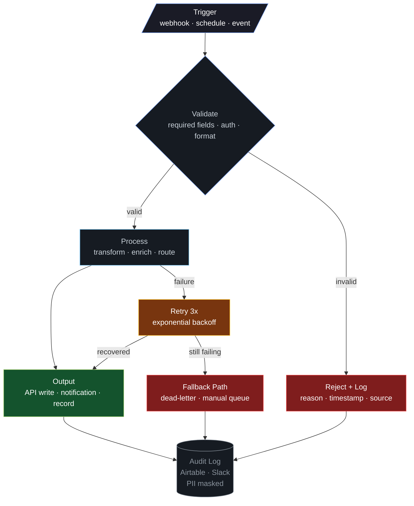

<a href="https://github.com/lorenzespinosa">
  
</a>

<p align="center">
  
  
  
</p>

<p align="center">
  <a href="https://www.linkedin.com/in/lorenz-leslie-espinosa/"></a>
  <a href="mailto:renzespinosa13@gmail.com"></a>
  
</p>

<br>

<p align="center">
  
</p>

<br>

<p align="center">
  <b>I build reliable, self-hosted AI automation for ops-heavy businesses — fixing the broken process and cutting SaaS/Zapier bloat first, then adding AI exactly where it earns its keep.</b><br>
  <sub>Self-hosted, webhook-driven systems that validate, retry, log, and recover — heavy lifting kept local, private, and reliable. <b>50+ processes automated · $800K+ saved · self-hosted & private.</b></sub>
</p>

<p align="center">
  
  &nbsp;
  <a href="https://lorenzespinosa.github.io"></a>
  &nbsp;
  <a href="mailto:renzespinosa13@gmail.com?subject=Automation%20project%20inquiry"></a>
  &nbsp;
  <a href="https://www.linkedin.com/in/lorenz-leslie-espinosa/"></a>
</p>

<br>

```yaml
apiVersion: automation/v1
kind: Engineer
metadata:
  name: Lorenz Leslie Espinosa
  role: AI Systems & Automation Architect — n8n & AI Agent Developer
spec:
  orgs:
    - name: Leppard Law
      focus: Legal ops — intake, case management, billing, client comms
    - name: Le Cordon Bleu International
      focus: IT infrastructure & marketing automation across multi-tenant Microsoft Cloud
  architecture:
    pattern: self-hosted, webhook-driven, API-first (Docker Compose + Traefik)
    buffer_layer: Airtable (staging between systems)
    error_handling: retry 3x with backoff → fallback path → audit log → alert
    principle: fix the process first · self-hosted · never fail silently
  ai_usage:               # placed where it earns its keep, not bolted on
    production: LLOpenClaw v5.0 — Slack ops bot, AI agents + human-in-the-loop
    discipline: 21 MCP tools via n8n — deterministic core, AI only where it pays off
    efficiency: [semantic caching, hybrid model routing, local/edge inference]
    models: cheapest capable model per task — no slop, no surprise bills
  exploring: [Qdrant local RAG, local SLMs (Phi/Qwen), Temporal workflows, edge inference]
```


<table>
<tr>
<td>

**`> status`** &nbsp; LLOpenClaw v5.0 live &nbsp;·&nbsp; 21 MCP tools &nbsp;·&nbsp; 3 specialist agents &nbsp;·&nbsp; orchestrator + human-in-the-loop &nbsp;·&nbsp; saving ~$65/mo in token costs

</td>
</tr>
</table>


## Work With Me

> I turn manual, error-prone processes into reliable systems that run on your own infrastructure — fixing the process and cutting SaaS bloat, with AI placed only where it earns its keep. Four ways to start; every engagement ships with error handling, audit logging, and documentation.

<table>
<tr>
<td width="50%" valign="top">

<h3>🔍 Automation Audit</h3>

I map your current workflows, find the highest-ROI things to automate, flag the overlapping tools and SaaS subscriptions you're overpaying for, and hand you a prioritized roadmap with effort vs. impact.

<sub><b>Best first step</b> · ~1 week · low commitment</sub>

</td>
<td width="50%" valign="top">

<h3>⚙️ Build &amp; Ship</h3>

Fixed-scope automation built end-to-end: trigger → validate → process → integrate → audit log. Tested, documented, handed off.

<sub><b>Most popular</b> · 2–4 weeks · fixed scope</sub>

</td>
</tr>
<tr>
<td width="50%" valign="top">

<h3>🤖 AI Agents &amp; Orchestration</h3>

AI agents that do real ops work — wired to the right tools, gated by human approval, and kept efficient so they don't sprawl or run up surprise bills. AI placed where it earns its keep, not bolted onto everything.

<sub>Custom · for teams putting AI into production</sub>

</td>
<td width="50%" valign="top">

<h3>🔁 Fractional Automation Engineer</h3>

I own your automation backlog: maintain what's live, fix what breaks, and ship new workflows every month. Like an in-house engineer, part-time.

<sub>Ongoing · monthly retainer</sub>

</td>
</tr>
</table>

<p align="center">
  <sub><b>How I work:</b> &nbsp; 🔎 Discovery (free 15-min call) &nbsp;→&nbsp; 📐 Scope &amp; proposal &nbsp;→&nbsp; 🛠️ Build &amp; test &nbsp;→&nbsp; 🚀 Launch + docs &nbsp;→&nbsp; 🔄 Support</sub>
</p>

<p align="center">
  <a href="mailto:renzespinosa13@gmail.com?subject=Automation%20project%20inquiry&body=Hi%20Lorenz%2C%0A%0AHere's%20what%20I%20need%20help%20with%3A%0A%0AGoal%3A%0ASystems%2Ftools%20involved%3A%0ATimeline%3A%0A"></a>
</p>


## Flagship Systems

> Not workflows — **production systems** with error handling, observability, and measurable business outcomes.

<table>
<tr>
<td width="50%" valign="top">

<h3>🟢 LLOpenClaw</h3>

**Ops Slack bot — AI agents done right, human-gated**

Orchestrator delegates to specialist agents (exec, research, ops) with human-in-the-loop gates, n8n MCP integration (21 tools), identity stack, and hybrid model routing — efficient, reliable, and gated where it counts.

<sub>OpenClaw · Slack · n8n MCP · Claude · Lawmatics · Clio</sub>


</td>
<td width="50%" valign="top">

<h3>🟢 Legal Intake Pipeline</h3>

**Event-driven lead capture → CRM routing**

Webhook capture → validation → AI classification → CRM routing → case creation. Replaced manual data entry across 3 systems.

<sub>n8n · OpenPhone · Lawmatics · Filevine · Airtable</sub>


</td>
</tr>
<tr>
<td width="50%" valign="top">

<h3>🟢 Hybrid Lead Conversion Engine</h3>

**Deterministic routing + one capped AI call**

Rules route and qualify; a single constrained model call scores and drafts a reply only where it adds real signal. Full pipeline from capture to conversion, on a budget.

<sub>n8n · hybrid routing · Celonis · CRM</sub>

 

</td>
<td width="50%" valign="top">

<h3>🟢 Billing Sync Engine</h3>

**Bidirectional case management ↔ billing**

Fully deterministic sync between case management and billing with conflict resolution. CRM is source of truth — not one token spent.

<sub>n8n · Clio · Filevine · Airtable</sub>


</td>
</tr>
</table>

<details>
<summary><b>More systems I've built</b></summary>
<br>

| System | What It Does | Impact |
|--------|-------------|--------|
| **Multi-Agent Task Delegator** | Central AI controller routes natural-language commands to specialized workflows | Routine task time **-30%** |
| **Smart Contract Monitor** | Real-time on-chain Ethereum event detection with anomaly alerting | Diagnosis time **-60%** |
| **AWS Health Sentinel** | Serverless monitoring of AWS Health events → Slack/email alerts | Incident response **-40%** |
| **Discord-Jira Issue Bridge** | Community issues auto-flow into project tracking | **100+ issues/month**, zero manual entry |
| **Community Security System** | Automated phishing, scam bot, impersonation detection | Member retention **+25%** |
| **Martech Data Pipeline** | Unified 1.5TB event data across 6 clients for campaigns | Email CTR **+30%**, churn **-18%** |
| **LLM Compliance Monitor** | AI-RMF aligned pipeline monitoring 100+ agents for bias/drift | **100% regulatory approval** (EU + US) |

</details>


## Open Source

<table>
<tr>
<td width="50%" valign="top">

### <a href="https://github.com/lorenzespinosa/n8n-lint">n8n-lint</a>

<a href="https://github.com/lorenzespinosa/n8n-lint"></a> <a href="https://github.com/lorenzespinosa/n8n-lint"></a> 

**Static analysis for n8n workflow JSON.** Catches credential leaks, deprecated nodes, orphaned connections, and best-practice violations.

```bash
npx n8n-lint .                 # lint all workflows
npx n8n-lint --fix workflows/  # auto-fix safe issues
npx n8n-lint --format json .   # JSON output for CI
```

<sub>16 rules · configurable · auto-fix · CI-ready</sub>

</td>
<td width="50%" valign="top">

### <a href="https://github.com/lorenzespinosa/openclaw-n8n-stack">openclaw-n8n-stack</a>

<a href="https://github.com/lorenzespinosa/openclaw-n8n-stack"></a> <a href="https://github.com/lorenzespinosa/openclaw-n8n-stack"></a> 

**Docker stack: AI agent gateway + workflow automation.** OpenClaw + n8n + PostgreSQL in one `docker compose up`. Pre-wired MCP, multi-agent config.

```bash
git clone ...openclaw-n8n-stack.git
cp .env.example .env && docker compose up -d
```

<sub>saves ~$65/mo · MCP · multi-agent · Docker</sub>

</td>
</tr>
</table>

<table>
<tr>
<td width="33%" valign="top">

<h4><a href="https://github.com/lorenzespinosa/n8n-error-handling-pattern">n8n-error-handling-pattern</a></h4>

Retry with backoff, dead-letter queue, fallback paths, PII-masked audit logging.

<sub><a href="https://github.com/lorenzespinosa/n8n-error-handling-pattern"></a></sub>

</td>
<td width="33%" valign="top">

<h4><a href="https://github.com/lorenzespinosa/n8n-legal-ops-templates">n8n-legal-ops-templates</a></h4>

Client intake, missed call recovery, billing sync, AI case routing.

<sub><a href="https://github.com/lorenzespinosa/n8n-legal-ops-templates"></a></sub>

</td>
<td width="33%" valign="top">

<h4><a href="https://github.com/lorenzespinosa/n8n-ai-agent-delegator">n8n-ai-agent-delegator</a></h4>

Multi-agent orchestrator with confidence scoring and human-in-the-loop.

<sub><a href="https://github.com/lorenzespinosa/n8n-ai-agent-delegator"></a></sub>

</td>
</tr>
<tr>
<td width="33%" valign="top">

<h4><a href="https://github.com/lorenzespinosa/openclaw-setup-guide">openclaw-setup-guide</a></h4>

Production deployment guide — identity stack, security, n8n MCP.

<sub><a href="https://github.com/lorenzespinosa/openclaw-setup-guide"></a></sub>

</td>
<td width="33%" valign="top">

<h4><a href="https://github.com/lorenzespinosa/airtable-automation-toolkit">airtable-automation-toolkit</a></h4>

Python toolkit — DLQ, audit logging, PII masking, staging sync.

<sub><a href="https://github.com/lorenzespinosa/airtable-automation-toolkit"></a></sub>

</td>
<td width="33%" valign="top">

<h4><a href="https://github.com/lorenzespinosa/openphone-n8n-connector">openphone-n8n-connector</a></h4>

OpenPhone + n8n — missed calls, SMS, call logging. TCPA compliant.

<sub><a href="https://github.com/lorenzespinosa/openphone-n8n-connector"></a></sub>

</td>
</tr>
</table>


## Architecture Pattern

> Every system I build follows this pattern. Every path terminates in an audit log. Nothing fails silently.


```mermaid
flowchart TD
    A[/"Trigger<br/>webhook · schedule · event"/] --> B{"Validate<br/>required fields · auth · format"}
    B -->|valid| C["Process<br/>transform · enrich · route"]
    B -->|invalid| D["Reject + Log<br/>reason · timestamp · source"]
    C --> E["Output<br/>API write · notification · record"]
    C -->|failure| F["Retry 3x<br/>exponential backoff"]
    F -->|still failing| G["Fallback Path<br/>dead-letter · manual queue"]
    F -->|recovered| E
    E --> H[("Audit Log<br/>Airtable · Slack<br/>PII masked")]
    G --> H
    D --> H

    style A fill:#1a1b26,stroke:#7aa2f7,color:#fff
    style B fill:#161b22,stroke:#7aa2f7,color:#c9d1d9
    style C fill:#161b22,stroke:#7dcfff,color:#c9d1d9
    style D fill:#7f1d1d,stroke:#ef4444,color:#fff
    style E fill:#14532d,stroke:#9ece6a,color:#fff
    style F fill:#78350f,stroke:#fbbf24,color:#fff
    style G fill:#7f1d1d,stroke:#ef4444,color:#fff
    style H fill:#161b22,stroke:#8b949e,color:#8b949e
```


## Stack

<p align="center">
  
</p>

<table>
<tr>
<td valign="top" width="33%">

**Self-Hosted Orchestration**


</td>
<td valign="top" width="33%">

**AI — Where It Earns Its Keep**


</td>
<td valign="top" width="33%">

**Legal Ops & CRM**


</td>
</tr>
</table>


## Certifications

<p align="center">
  
  
  
  
  
  
  
  
  
  
  
  
  
  
  
  
</p>


## Activity

<p align="center">
  <a href="https://github.com/lorenzespinosa">
    
  </a>
</p>

<p align="center">
  <a href="https://github.com/lorenzespinosa">
    
  </a>
</p>

<p align="center">
  <picture>
  <source media="(prefers-color-scheme: dark)" srcset="https://raw.githubusercontent.com/lorenzespinosa/lorenzespinosa/output/github-snake-dark.svg" />
  <source media="(prefers-color-scheme: light)" srcset="https://raw.githubusercontent.com/lorenzespinosa/lorenzespinosa/output/github-snake.svg" />
  
</picture>
</p>

<br>


<br>

<p align="center">
  <sub><i>"I'm not here to bolt AI onto everything. I fix the process, cut the bloat, and put AI exactly where it earns its keep — so what you ship is reliable, private, and worth paying for."</i></sub>
</p>

<br>

<h3 align="center">Drowning in tools and subscriptions — or a process that still eats hours? Let's fix it.</h3>

<p align="center">
  <sub>Tell me your <b>goal</b>, the <b>tools involved</b>, and your <b>timeline</b> — I'll reply with whether it's a fit and the fastest path to ship it.</sub>
</p>

<p align="center">
  <a href="mailto:renzespinosa13@gmail.com?subject=Automation%20project%20inquiry&body=Hi%20Lorenz%2C%0A%0AGoal%3A%0ASystems%2Ftools%20involved%3A%0ATimeline%3A%0A"></a>&nbsp;&nbsp;
  <a href="https://www.linkedin.com/in/lorenz-leslie-espinosa/"></a>
</p>

<p align="center">
  <sub>Automation Architect &nbsp;·&nbsp; building legal ops automation at <a href="https://www.leppardlaw.com">Leppard Law</a> &nbsp;·&nbsp; fully remote &nbsp;·&nbsp; available for projects worldwide</sub>
</p>

<a href="https://github.com/lorenzespinosa">
  
</a>
